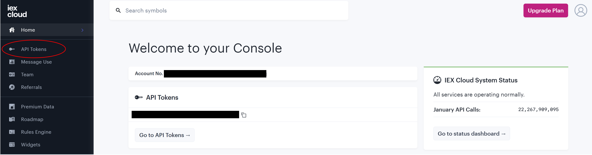
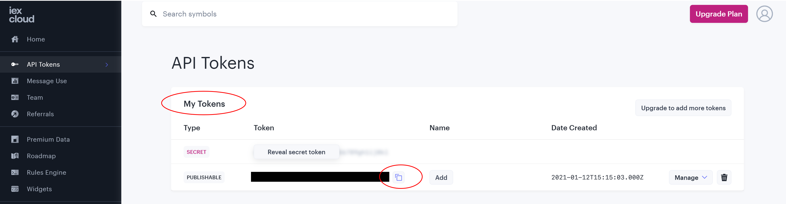

# Algorithmic Trading

## Introduction

This repo will be used to show sample ways (using *fake stock data*) to create several investment strategies through `Python` and the `IEX CLOUD` API.

Investment Strategies covered:

- Equal-Weight Index Investing Strategy
- Quantitative Momentum Investing Strategy
- Quantitative Value Investing Strategy

We will be using the `pandas` library to accomplish:
- Data cleaning
- Data merging
- Feature extraction

We will be using the `numpy` library to accomplish:
- math calculations to prevent over-investing (floor / ceil)
- array splitting

We will be using the `requests` library to accomplish:
- API connection
- Downloading JSON data for parsing

## Project Organization

    │
    ├── data/               <- The original, immutable data dump. 
    │
    ├── notebooks/          <- Jupyter notebooks. 
    │
    │
    ├── algorithmictrading/  <- Source code. 
    │
    ├── LICENSE
    │
    ├── requirements.txt     <- pip package dependencies.   
    │
    ├── README.md            <- The top-level README.
    │
    
## Set up
- Sign up for a free account with [IEX CLOUD](https://iexcloud.io/).
- Create a .env file to hold the [API token](https://iexcloud.io/console/tokens).

- Download the sample S&P 500 ticker list [here](http://nickmccullum.com/algorithmic-trading-python/sp_500_stocks.csv).

